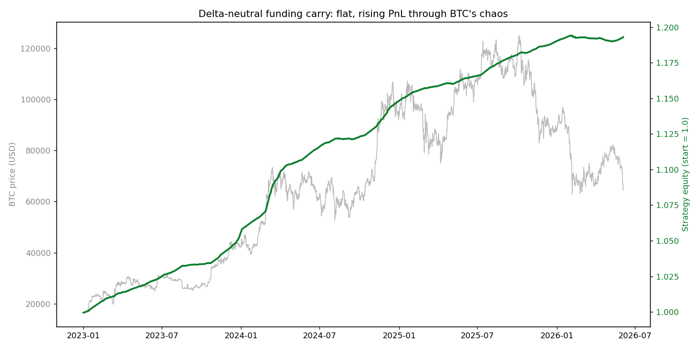

# Delta-Neutral Funding-Carry — a CMC Strategy Skill

> A CoinMarketCap Agent Skill that earns perpetual **funding** while staying **market-neutral** —
> and, just as importantly, knows when to sit in stablecoins and do nothing.
>
> Built for **BNB HACK: AI Trading Agent Edition** — Track 2 (Strategy Skills).

**🌐 Live overview → [delta-neutral-carry.vercel.app](https://delta-neutral-carry.vercel.app)**

## The idea in one line

Hold BTC spot (long) and short the same notional in a BTC perpetual. Price moves cancel
(**delta ≈ 0**), so the only return left is the funding rate longs pay shorts. Collect it when
the market pays to carry; step aside when funding turns deeply negative.

This is **risk-premium** income, not price speculation — the one edge a retail agent can
actually harvest without speed or inside information.

## The insight that makes it work

The naive version of this strategy **loses money**. We found out by backtesting it.

The killer is **turnover**. Any rule that toggles in and out of the carry every time funding
dips near zero racks up hundreds of trades, and fees + slippage on two legs bleed it dry. The
strategies that constantly "optimized" their entry lost 6–9%. The strategy that simply **held
the carry continuously and only bailed on a deeply-negative funding regime** won — with almost
no trades.

So the rule isn't "time the funding." It's **"hold the carry; minimize turnover; only step
aside when funding genuinely turns against you."** That was *discovered* in the data, not assumed.

## Results — 3.4-year backtest (2023-01-01 → 2026-06-03)

Funding on BTC was positive **85.9%** of the time (mean **7.41% APR**).

| Strategy | Return | APR | Max DD | Sharpe | Trades |
|----------|-------:|----:|-------:|-------:|-------:|
| **This skill** (hold; exit only if funding < −15% APR) | **+19.35%** | **5.31%** | **−0.35%** | **25.5** | **2** |
| harvest (enter >2% APR, exit <0) | −6.51% | −1.95% | −10.08% | −2.9 | 456 |
| always-on (any positive funding) | −9.44% | −2.86% | −11.93% | −4.1 | 514 |
| "smart" overlay (8%/3% + greed guard) | −6.86% | −2.06% | −8.12% | −3.7 | 416 |
| *benchmark:* buy & hold BTC | +290% | 48.9% | **−49.7%** | 1.1 | 0 |

Read this the right way: buy-and-hold made far more — with a **−50% drawdown**. This skill makes
a steady ~5% APR with a **−0.35%** max drawdown and a Sharpe of **~25**. Different product, for
people who want yield without the rollercoaster. Judge it on **risk-adjusted** terms.



*Flat, rising strategy equity (green) through BTC's full boom-and-crash (grey).*

## How the skill works

The skill is a small **state machine** the agent runs on live CMC data:

1. **Read the signal** — `get_global_crypto_derivatives_metrics` for market-wide funding,
   open interest, and liquidations; `get_global_metrics_latest` for Fear & Greed; BTC spot price.
2. **Decide** — `FLAT → ENTER` when annualized funding ≥ +5%; `DEPLOYED → EXIT` only when funding
   falls below the **−15% circuit breaker**; otherwise **HOLD** (the most common, correct action).
3. **Report** — a concrete, auditable allocation: deploy %, both legs, the single trigger that
   would change the position.

CMC only exposes **aggregate** funding (no per-asset figure — see
[`data-sources.md`](skills/delta-neutral-carry/references/data-sources.md)), so the skill
deliberately uses aggregate funding as a *regime signal* and runs the carry on the single
deepest-liquidity leg (BTC). Simpler, more robust, fully CMC-native.

## Install (Claude Desktop / any Claude-skill host)

```bash
cp -r skills/delta-neutral-carry /path/to/your/skills/directory/
```

Then connect the CoinMarketCap MCP (get a key at https://pro.coinmarketcap.com/login):

```json
{
  "mcpServers": {
    "cmc-mcp": {
      "url": "https://mcp.coinmarketcap.com/mcp",
      "headers": { "X-CMC-MCP-API-KEY": "your-api-key" }
    }
  }
}
```

Ask: *"Should I be in a funding carry right now?"* or `/delta-neutral-carry`.

## Reproduce the backtest

```bash
python -m venv .venv && ./.venv/bin/pip install pandas numpy matplotlib requests
./.venv/bin/python backtest/backtest.py
```

All data is fetched free, no API key (Binance funding/klines + alternative.me Fear & Greed).
Outputs land in `backtest/output/`.

## Repo structure

```
skills/delta-neutral-carry/
  SKILL.md                     the strategy as deterministic rules (the deliverable)
  references/
    data-sources.md           exactly what CMC exposes for funding (and what it doesn't)
    backtest.md                method, full results, and honest limits
backtest/
  backtest.py                  runnable validation over 3.4 years of real data
  output/equity_curve.png      the chart above
```

## Honest limits

The backtest assumes a **perfect hedge**. Live, there's basis drift, funding-timing slip, and
short-leg liquidation risk if margin isn't actively defended — so real net returns sit below the
~5% APR shown. Execution venue is **ApolloX** on BSC (spot on PancakeSwap), whose funding and
liquidity differ from the Binance data used as a historical proxy. Full caveats in
[`backtest.md`](skills/delta-neutral-carry/references/backtest.md).

---

Built with CoinMarketCap data. MIT licensed.
